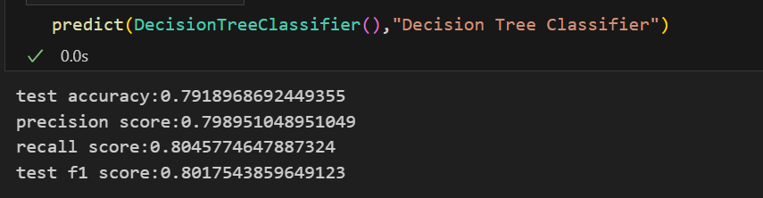

# Cardiovascular Risk Prediction

This project aims to predict the 10-year risk of cardiovascular disease (CVD) based on various health-related features. The dataset used in this project is derived from a cardiovascular study and contains information on multiple risk factors.

## Table of Contents

- [Overview](#overview)
- [Objective](#objective)
- [Variables Description](#variables-description)
- [Data Preprocessing](#data-preprocessing)
- [Exploratory Data Analysis (EDA)](#exploratory-data-analysis-eda)
- [Data Cleaning](#data-cleaning)
- [Feature Engineering](#feature-engineering)
- [Modeling](#modeling)
- [Results](#results)

## Overview

Cardiovascular diseases are the leading cause of death globally. Identifying individuals at risk can help in preventive measures and treatments. This project utilizes machine learning techniques to predict the 10-year cardiovascular disease risk based on a set of features such as age, sex, cholesterol levels, and smoking habits.

## 🌟 **Objective** 🌟

The main task is to predict whether a patient has a **10-year risk** of developing coronary heart disease (CHD) 🩺🫀. This involves determining the likelihood that a patient will develop CHD within the next 10 years based on specific factors.

🔍 **Your Goal**: Build a predictive model using data on patients' demographics, behaviors, and medical history to classify them into one of two categories:

### 📊 **Classification Categories**:
- **🚨 High Risk (1)**: The patient is predicted to have a high likelihood of developing CHD within the next 10 years.
- **✅ Low Risk (0)**: The patient is predicted to have a low likelihood of developing CHD within the next 10 years.

By accurately predicting these categories, you can help in early intervention and potentially life-saving preventive measures! 💪❤️

## 🗂️ **Variables Description**

The dataset consists of the following attributes, categorized into demographic, behavioral, and medical factors:

### 👥 **Demographic Factors**

- **👨‍⚕️ Sex**: The gender of the patient, coded as "M" (male) or "F" (female).
- **🎂 Age**: The age of the patient, recorded as a continuous variable.

### 🚬 **Behavioral Factors**

- **🚭 is_smoking**: Whether the patient is a current smoker, recorded as "YES" or "NO."
- **🚬 Cigs Per Day**: The average number of cigarettes the patient smokes per day, treated as a continuous variable.

### 🩺 **Medical History Factors**

- **💊 BP Meds**: Whether the patient is on blood pressure medication (Nominal).
- **🧠 Prevalent Stroke**: Whether the patient has had a stroke in the past (Nominal).
- **💉 Prevalent Hyp**: Whether the patient is hypertensive (Nominal).
- **🍬 Diabetes**: Whether the patient has diabetes (Nominal).

### 📈 **Current Medical Factors**

- **🧪 Tot Chol**: Total cholesterol level, recorded as a continuous variable.
- **🩸 Sys BP**: Systolic blood pressure, recorded as a continuous variable.
- **🩸 Dia BP**: Diastolic blood pressure, recorded as a continuous variable.
- **⚖️ BMI**: Body Mass Index, recorded as a continuous variable.
- **❤️ Heart Rate**: The heart rate of the patient, treated as a continuous variable.
- **🍭 Glucose**: Glucose level, recorded as a continuous variable.

### 🎯 **Predictive Variable (Target)**

- **🔍 10-year risk of CHD**: The target variable indicating whether the patient has a 10-year risk of coronary heart disease, coded as binary (1 for "Yes," 0 for "No").

- **Size**: 3390 samples, 16 columns

## 💹 Data Preprocessing

### 1. Data Inspection

- **Shape of the Dataset**: 3390 samples and 16 columns.
- **Dataset Info**: Detailed information about each feature, including data types and null values.
- **Checking for Duplicates**: No duplicate rows found.

### 2. Missing Value Analysis

- **Columns with Missing Values**:
  - `education`: 2.57% missing
  - `cigsPerDay`: 0.65% missing
  - `BPMeds`: 1.30% missing
  - `totChol`: 1.12% missing
  - `BMI`: 0.41% missing
  - `heartRate`: 0.03% missing
  - `glucose`: 8.97% missing

- **Visualizing Missing Data**: 
  - Used `missingno` to create bar and dendrogram plots.
  - Heatmap visualization for missing values.  

### 3. Data Cleaning

- **Dropping Null Values**: 
  - Dropped rows with null values in features with less than 5% missing data.
  - Imputed missing values in the `glucose` column with the median value.

- **Outlier Treatment**:
  - Identified outliers in the numeric features using boxplots.
  - Applied the Interquartile Range (IQR) method to cap outliers.

## 📊 Exploratory Data Analysis (EDA)

### 1. Univariate Analysis

- **Numeric Features**: 
  - Distribution of numeric features visualized using histograms with KDE plots.
  - Identified right-skewed distribution in `glucose`, indicating potential outliers.

- **Categorical Features**: 
  - Count plots for categorical features to understand the distribution.

### 2. Outlier Analysis

- **Box Plots**: 
  - Generated box plots for each numeric feature to visualize the presence of outliers.

## 📉 Feature Engineering

### 1. Label Encoding

- Converted categorical variables to numeric using label encoding:
  - `sex`: Mapped "M" to 1 and "F" to 0.
  - `is_smoking`: Mapped "YES" to 1 and "NO" to 0.

### 2. Feature Scaling

- Applied `StandardScaler` to normalize the numeric features, ensuring all features are on the same scale.

## 💻⬇️ Modeling

### 1. Model Selection

- Models considered for this project include:
  - Logistic Regression
  - Random Forest
  - Decision Tree

### 2. Model Evaluation

- Evaluation metrics used:
  - Accuracy
  - Precision
  - Recall
  - F1-Score

## ❗ Results

- The final model's performance was evaluated based on the selected metrics.
- The results demonstrated that the model effectively predicts the 10-year risk of cardiovascular disease.

## ⬇️ Conclusion

This project successfully implemented a machine learning pipeline to predict cardiovascular disease risk based on various health features. The model's predictions can aid in identifying high-risk individuals and potentially guide preventive healthcare measures.

## Dependencies

- Python 3.8+
- Pandas
- NumPy
- Seaborn
- Matplotlib
- Scikit-learn
- Plotly
- Missingno

